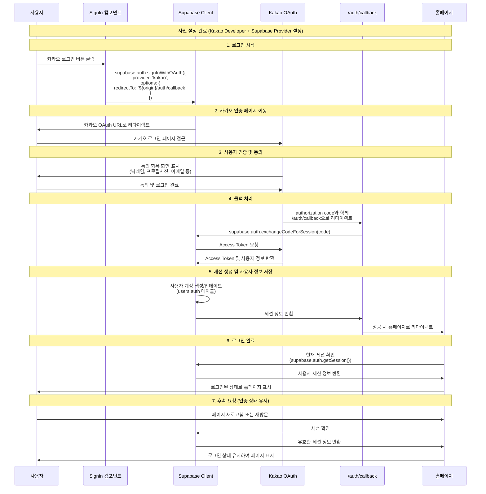

## 카카오 인증 with supabace

> supabase에서 나 대신 인증을 하고(supabse <-> kakao), 내 사이트를 redirection url로 해서 인증 결과를 받고, 인증 관련 database등은 supabase에서 관리해줌.

자료 : https://euni8917.tistory.com/m/575



```tsx
async function signInWithKakao() {
  const { data, error } = await supabase.auth.signInWithOAuth({
    provider: "kakao",
    options: {
      redirectTo: process.env.NEXT_PUBLIC_VERCEL_URL
        ? `https://${process.env.NEXT_PUBLIC_VERCEL_URL}/auth/callback`
        : "http://localhost:3000/auth/callback",
    },
  });
}
```

#### redirect 주소 설정

1. supabse redirection URL 등록

- supabase > 프로젝트 > Authentication > URL Configuration > Redirect URLs 여기에 추가가 필요한듯.
- Site URL에는 기본적으로 http://localhost:8000은 등록이 되어있는 것 같고, 그게 아니라면 production용 환경 URL은 등록해줘야하는 것 같음
  (이기에 등록된 url이 아니면 redirection이 불가능한 것으로 보임)

2. supabaseWithOAuth 메으드의 redirectionTo 옵션 지정

- app/auth/callback/route.ts

```ts
import { cookies } from "next/headers";
import { NextResponse } from "next/server";
import { type CookieOptions, createServerClient } from "@supabase/ssr";
import { createServerSupabaseClient } from "utils/supabase/server";

export async function GET(request: Request) {
  const { searchParams, origin } = new URL(request.url);
  const code = searchParams.get("code"); // if "next" is in param, use it as the redirect URL
  const next = searchParams.get("next") ?? "/";

  if (code) {
    const supabase = await createServerSupabaseClient();
    const { error } = await supabase.auth.exchangeCodeForSession(code);
    if (!error) {
      return NextResponse.redirect(`${origin}${next}`);
    }
  } // return the user to an error page with instructions

  return NextResponse.redirect(`${origin}/auth/auth-code-error`);
}
```
